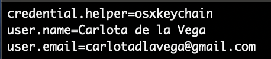
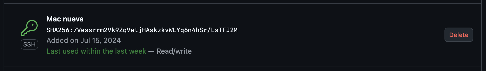

## Definición
Pokémon Card Trading es una plataforma de intercambio de cartas de Pokémon en la
que los usuarios pueden ver las cartas de los demás usuarios de la plataforma,
seleccionar aquella en la que estén interesados y ofrecer una carta a cambio. Los
usuarios pueden negociar intercambios, aceptar o rechazar ofertas y realizar un
siguimiento de sus cartas e intercambios en curso.

## Características
- **Registro y autenticación**: Los usuarios pueden registrarse y autenticarse
para realizar intercambios.

- **Gestión de cartas**: Los usuarios pueden ver, agregar y eliminar sus cartas.

- **Ofertas de intercambio**: Los usuarios pueden hacer ofertas de intercambio
por cartas de otros usuarios.

- **Sistema de contraoferta**: Los usuarios pueden aceptar, rechazar o hacer
contraofertas para mejorar sus propuestas.

- **Historial de intercambios**: Registro de todos los intercambios registrados.

## Desarrollo
Para el desarrollo del proyecto se va a utilizar el lenguaje de programación 
([TypeScript](https://www.typescriptlang.org)), por la flexibilidad y la
escalabilidad que ofrece, dando la posibilidad de implementar no solo el backend
sino también el frontend, con la ayuda de frameworks como ([Vue](https://vuejs.org)).

Para llevar un mayor control de los avances, se usarán issues para cada
tarea a solucionar y milestones para cada objetivo a corto plazo. Además, para
cada hito definido en la asignatura, se creará un PR en el repositorio, que, una
vez terminado, será mergeado a la rama main para ser corregido.

## Configuración
Al ser github una herramienta de trabajo habitual para mi, ya tengo configurado
tanto el perfil (foto, nombre completo, ciudad y universidad), como mi máquina
local y el doble factor de autenticación.

Credenciales de git en mi terminal:  

Clave SSH en github:

