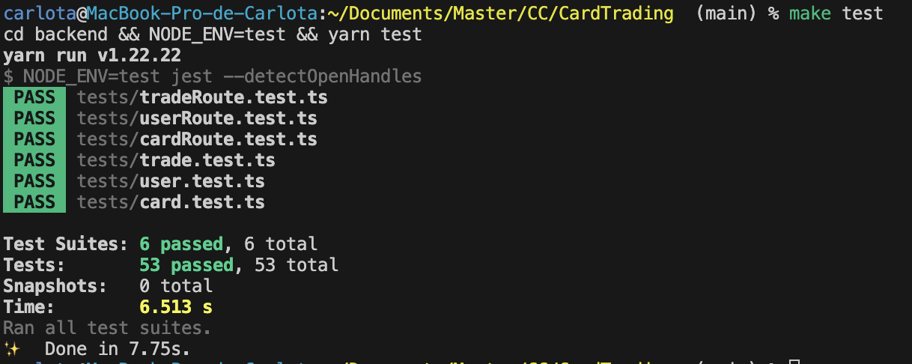

# Herramientas para los tests
Para ejecutar los tests necesitamos un test runner.

## Criterios
- **Compatibilidad**: Compatibles con TypeScript.
- **Aserciones**: Biblioteca de aserciones propia, o que sea compatible con
alguna de ellas.
- **Capacidad de paralelización**: Ejecutar pruebas en paralelo.

## Opciones
Vamos a valorar las siguientes opciones de test runner: Jest, Mocha y Jasmine;
y Chai como biblioteca de aserciones.

Las tres opciones son compatibles con TypeScript, por tanto, nos fijaremos en
los otros dos criterios. Tanto Jest como Jasmine tienen su propia biblioteca,
y Mocha permite la elección de la misma, así que será el tercer criterio el 
decisivo; Jest es el único que permite la ejecución paralela de pruebas.

En cuanto a la biblioteca de aserciones, Chai proporciona una sintaxis clara y
es muy utiliza con Mocha. Además, ofrece múltiples estilos de aserciones e 
integración con varios frameworks de tests. Sin embargo, debemos tener en cuenta
si el test runner elegido tiene biblioteca de aserciones incluida.

## Elección
Para este proyecto utilizaremos Jest, ya que es especialmente fuerte en
proyectos basados en TypeScript y cumple con todos los criterios establecidos.
Además, podemos aprovechar las aserciones integradas que ofrece, asi como su 
CLI.

## Evaluación de los tests
Aquí podemos ver el runneo de los tests desde la terminal:  

Y desde el workflow del último commit: [107ab6f](https://github.com/carlotiii30/CardTrading/commit/107ab6f35d23b36859d4009e963bd2a16bfb353e)  

# Tests para la API
Para garantizar que nuestra API funcione correctamente, se han implementado
tests de integración utilizando la biblioteca Supertest.
Esta herramienta permite simular solicitudes HTTP hacia las rutas definidas en
la aplicación sin necesidad de ejecutar un servidor real.

Utilizamos Supertest por:
- **Facilidad de uso**: Proporciona una interfaz sencilla para realizar pruebas
de solicitudes HTTP.
- **Compatibilidad**: Funciona directamente con aplicaciones Express.js.
- **Verificación exhaustiva**: Permite comprobar el estado HTTP, encabezados,
cuerpo de la respuesta y más.
- **Integración con Jest**: Se combina perfectamente con Jest.

## Evaluación de los tests
Aquí podemos ver el runneo de los tests desde la terminal:  

